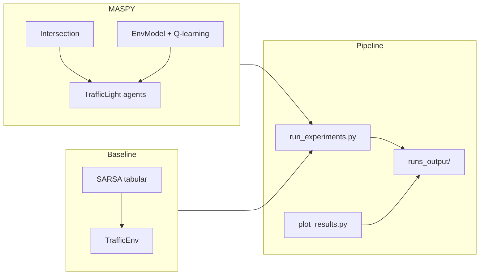

# Smart Intersection ? Controle de Semáforos com MASPY e Aprendizado por Reforço

Implementação experimental para o **TCC 2** (Trabalho de Conclusão de Curso): simulação de um cruzamento inteligente com quatro vias (N, S, L, O), controle adaptativo de fases semafóricas via **MASPY** (framework multiagente BDI com RL integrado) e comparação pareada com um **baseline SARSA** monolítico.

O repositório inclui pipeline de experimentos reprodutíveis, geração de métricas em CSV, gráficos comparativos e visualização interativa em Pygame.

---

## Sumário

- [Visão geral](#visão-geral)
- [Arquitetura](#arquitetura)
- [Requisitos](#requisitos)
- [Instalação](#instalação)
- [Uso rápido](#uso-rápido)
- [Estrutura do projeto](#estrutura-do-projeto)
- [Experimentos e métricas](#experimentos-e-métricas)
- [Visualização (Pygame)](#visualização-pygame)
- [Configuração](#configuração)
- [Referências](#referências)
- [Licença](#licença)
- [Autor](#autor)

---

## Visão geral

O problema modelado é o controle de um cruzamento urbano em tempo discreto:

- **Estado:** filas por direção, fase atual do semáforo, tempo de verde decorrido, pressão entre eixos (N/S vs L/O), entre outros.
- **Ações:** manter fase (`hold`) ou alternar para fases individuais (`N`, `S`, `E`, `W`) ou combinadas (`NS`, `EW`).
- **Dinâmica:** chegadas estocásticas (Poisson), taxa de atendimento por passo, tempo mínimo de verde, penalidades por troca de fase e recompensa unificada (throughput, filas e saturação).

Dois abordagens são comparadas nas mesmas condições (seeds e sequências de chegada pareadas):

| Abordagem | Descrição |
|-----------|-----------|
| **MASPY** | Ambiente `Intersection` + agentes `TrafficLight` (um controlador + observadores) com Q-learning via `EnvModel` |
| **Baseline SARSA** | Ambiente tabular equivalente (`TrafficEnv`) treinado com SARSA clássico |

---

## Arquitetura



**Módulos compartilhados** (`rl_common.py`) garantem transição de estado, função de recompensa e schedulers de exploração/aprendizado idênticos entre MASPY e baseline, tornando a comparação justa.

---

## Requisitos

- **Python 3.12+**
- [MASPY](https://github.com/laca-is/MASPY) (`maspy-ml` no PyPI ou clone local do repositório)
- Dependências Python:
  - `numpy`
  - `pandas`
  - `matplotlib`
  - `pygame` (apenas para visualização)
  - `tensorboardX` (opcional, para logs de treino)

---

## Instalação

### 1. Clone o repositório

```bash
git clone https://github.com/Dev-Maestre/Smart-Queue-Agents-W-Maspy.git
cd Smart-Queue-Agents-W-Maspy
```

### 2. Crie e ative um ambiente virtual

```bash
python3 -m venv .venv
source .venv/bin/activate   # Linux/macOS
# .venv\Scripts\activate    # Windows
```

### 3. Instale as dependências

```bash
pip install maspy-ml numpy pandas matplotlib pygame
pip install tensorboardX   # opcional
```

### 4. MASPY local (alternativa)

Se você desenvolve com um clone local do MASPY, aponte o `PYTHONPATH` para a raiz do repositório:

```bash
export PYTHONPATH="/caminho/para/MASPY${PYTHONPATH:+:$PYTHONPATH}"
```

---

## Uso rápido

### Pipeline completo (experimentos + gráficos)

```bash
./run_all.sh
```

Modos de carga reduzida para máquinas mais limitadas:

```bash
./run_all.sh --light       # execução rápida (menos episódios/seeds)
./run_all.sh --light-plus  # meio-termo: mais dados, custo moderado
```

### Scripts individuais

```bash
# Rodar experimentos (MASPY + baseline, múltiplas seeds)
python run_experiments.py

# Gerar gráficos a partir do último run
python plot_results.py

# Relatório consolidado a partir de métricas
python generate_report.py

# Demonstração standalone do ambiente MASPY
python ex_smart_intersection.py

# Visualização interativa ou replay
python ex-smart_intersection_pygame.py
python ex-smart_intersection_pygame.py --replay-dir runs_output/combined_YYYYMMDD_HHMMSS
```

Os resultados são gravados em `runs_output/` com timestamp. Cada execução inclui um `README.md` local com os parâmetros utilizados.

---

## Estrutura do projeto

```
.
??? config.py                      # Hiperparâmetros globais (seeds, horizonte, recompensa, RL)
??? rl_common.py                   # Transição, recompensa e schedulers compartilhados
??? ex_smart_intersection.py       # Ambiente MASPY + agentes TrafficLight
??? sarsa_baseline.py              # Baseline SARSA tabular
??? run_experiments.py             # Pipeline de experimentos comparativos
??? plot_results.py                # Geração de gráficos
??? generate_report.py             # Relatório consolidado em Markdown
??? ex-smart_intersection_pygame.py # Visualização e replay
??? run_utils.py                   # Utilitários de diretório de execução
??? run_all.sh                     # Orquestração do pipeline
??? runs_output/                   # Saídas geradas (não versionar em produção)
```

---

## Experimentos e métricas

O script `run_experiments.py` executa, para cada seed configurada em `config.py`:

1. **Treino e avaliação** de MASPY (dois cruzamentos: I1 e I2) e baseline SARSA.
2. **Métricas de convergência** (janela móvel sobre recompensa por episódio).
3. **Adaptação a choque de demanda** (aumento súbito de chegadas em uma direção).
4. **Ablation de ?** (fator de desconto) para ambos os algoritmos.

### Principais arquivos de saída

| Arquivo | Conteúdo |
|---------|----------|
| `metrics_I1.csv`, `metrics_I2.csv` | Séries temporais MASPY |
| `metrics_baseline_I1.csv`, `metrics_baseline_I2.csv` | Séries temporais baseline |
| `experimentos_summary.csv` | Resumo por seed |
| `training_rewards_comparison.csv` | Recompensa cumulativa por episódio |
| `adaptation_shock_timeseries.csv` | Resposta ao choque de demanda |
| `adaptation_recovery_summary.csv` | Tempo de recuperação pós-choque |
| `ablation_gamma_summary.csv` | Resultados da ablation de ? |
| `relatorio_experimentos.md` | Relatório automático com IC 95% |

### Gráficos gerados (`plot_results.py`)

- Filas e throughput ao longo do tempo (alinhados e não alinhados)
- Barras com intervalo de confiança (fila média e throughput)
- Curvas de recompensa e convergência
- Choque de demanda e recuperação

---

## Visualização (Pygame)

A demo em Pygame permite:

- **Modo live:** treino e simulação com dois cruzamentos lado a lado.
- **Modo replay:** reproduzir métricas gravadas em CSV de execuções anteriores.

```bash
python ex-smart_intersection_pygame.py --replay-dir runs_output/combined_YYYYMMDD_HHMMSS --replay-step 0.5
```

Opções úteis:

```bash
--render-env both   # exibe I1 e I2 (padrão no modo live)
--render-env 1      # apenas cruzamento I1
--replay-i1 PATH    # CSV específico para I1
--replay-i2 PATH    # CSV específico para I2
```

> A renderização Pygame é desligada por padrão nos benchmarks (`RENDER_PYGAME = False` em `config.py`) para manter reprodutibilidade e desempenho.

---

## Configuração

Todos os hiperparâmetros centralizados estão em `config.py`:

| Parâmetro | Descrição |
|-----------|-----------|
| `SEEDS` | Seeds para repetibilidade estatística |
| `TRAIN_EPISODES_LONG` | Episódios de treino na avaliação principal |
| `HORIZON` | Passos por episódio na avaliação |
| `QUEUE_CAP`, `SERVICE_RATE` | Capacidade de fila e taxa de atendimento |
| `REWARD_*` | Pesos da função de recompensa unificada |
| `EPSILON_*`, `ALPHA_*` | Schedulers de exploração e aprendizado |
| `ADAPT_*` | Parâmetros do experimento de choque de demanda |
| `ABLATION_GAMMAS` | Valores de ? testados na ablation |

Ative o modo leve via variável de ambiente:

```bash
RUN_LIGHT=1 python run_experiments.py
```

Ou use `./run_all.sh --light`, que exporta as variáveis `LIGHT_*` correspondentes.

---

## Referências

- [MASPY ? Framework multiagente BDI em Python](https://github.com/laca-is/MASPY)
- [MASPY no PyPI (`maspy-ml`)](https://pypi.org/project/maspy-ml/)
- Silva et al., *MASPY: A Python-Based Framework for Developing BDI Multi-Agent Systems*, PAAMS 2025
- Trabalho sobre integração de RL ao MASPY, WESAAC 2025

---

## Licença

Este projeto foi desenvolvido no contexto acadêmico do TCC 2. Consulte o arquivo `LICENSE` (se presente) ou entre em contato com o autor para condições de uso.

O framework [MASPY](https://github.com/laca-is/MASPY) possui licença própria ? verifique o repositório oficial.

---

## Autor

**Gabriel Costa**

- Repositório: [Dev-Maestre/Smart-Queue-Agents-W-Maspy](https://github.com/Dev-Maestre/Smart-Queue-Agents-W-Maspy)
- GitHub: [@Dev-Maestre](https://github.com/Dev-Maestre)
